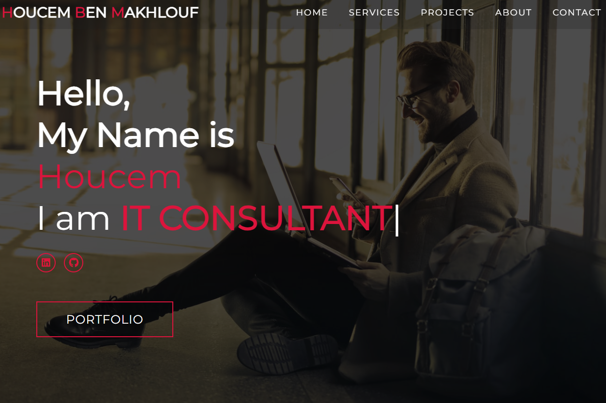

# **Personal Portfolio Website** 🚀

This is a **fully responsive** personal portfolio website built with **HTML, CSS, and JavaScript**. It showcases **IT consultancy, cloud solutions, AI-powered projects, and project management services** while maintaining a professional and modern design.

## **🔹 Features**

✅ **Responsive Design** – Adapts to all screen sizes (desktop, tablet, and mobile).  
✅ **Dynamic Typewriter Effect** – Highlights key expertise dynamically.  
✅ **Smooth Animations** – Powered by AOS (Animate on Scroll) for a professional touch.  
✅ **Interactive Navigation** – Includes a mobile-friendly hamburger menu.  
✅ **Projects Showcase** – Displays **real-world IT solutions** with a **fade-out effect**.  
✅ **Contact Section** – Features **email and social media links** with improved layout.

---

## **📂 Project Structure**
```plaintext
📁 portfolio-website
│── 📁 assets
│ │── 📁 images # Stores all website images
│ │── 📁 icons # Icons for services and social media
│── 📁 css
│ │── style.css # Main stylesheet
│── 📁 js
│ │── app.js # JavaScript for animations & effects
│── index.html # Main HTML file
│── README.md # Project documentation
```
---

## **🛠️ Technologies Used**

- **HTML5** – For structuring the webpage
- **CSS3** – For styling and responsive design
- **JavaScript (ES6)** – For interactive elements
- **FontAwesome** – For icons (LinkedIn, GitHub, etc.)
- **AOS (Animate On Scroll)** – For smooth animations

---

## **🎨 Customizations**

Want to personalize this portfolio? Modify the following:

1. **Profile Information** – Update your name, profession, and social media links in `index.html`.
2. **Projects** – Add or modify projects inside the `#projects` section in `index.html`.
3. **Theme & Colors** – Modify `style.css` for color schemes and font styles.
4. **Typewriter Text** – Change the skills inside `app.js` under the `typeWriter()` function.

---

## **📷 Preview Screenshot**



---

## **🚀 How to Run the Project**

1. **Clone the repository**

```bash
git clone https://github.com/houcembenmakhlouf/houcembenmakhlouf.github.io.git


Open index.html in any browser
You're all set! 🎉
📩 Contact
💼 Portfolio: Your Website
📧 Email: houcembenmakhlouf.hbm@gmail.com
🔗 LinkedIn: Your LinkedIn
🐙 GitHub: Your GitHub

📜 License
This project is open-source and free to use under the MIT License.
```
